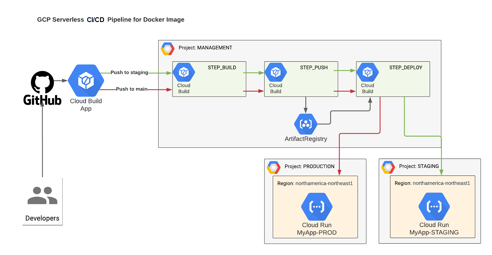

## DockerImage Build, Push and Deploy to GCP Cloud Run via GCP Cloud Build

<br><br>

In order to deploy via Cloud Build located in project MANAGEMENT to CloudRun located in project STAGING,PROD you will need:

1. In project MANAGEMENT, get email of account for `xxxxxxxx@cloudbuild.gserviceaccount.com`
2. In project STAGING and PROD add this account as princial into IAM and add Roles:

     | IAM Role Name         | IAM Role Permission             |
     |-----------------------|---------------------------------|
     | Cloud Run Admin       | `roles/run.admin`               |
     | Cloud Run Invoker     | `roles/run.invoker`             |
     | Service Account User  | `roles/iam.serviceAccountUser`  |


In order to CloudRun located in project STAGING and PROD to <b>PULL</b> docker images from Artifact Registry located in project MANAGEMENT you will need:
1. In project STAGING and PROD get email of account `service-xxxxx@serverless-robot-prod.iam.gserviceaccount.com`
2. In project MANAGEMENT in permissions of Artifact Registry Repository, add princial from Step-1 with the following role:
   - Artifact Registry Reader - `roles/artifactregistry.reader`

In order to CloudBuild located in project MANAGEMENT to <b>PUSH</b> docker images to Artifact Registry located in project MANAGEMENT you will need:
1. In project MANAGEMENT get email of account `xxxxxxxx@cloudbuild.gserviceaccount.com`
2. In project MANAGEMENT in permissions of Artifact Registry Repository, add princial from Step-1 with the following role:
   - Artifact Registry Writer - `roles/artifactregistry.writer`

# Etheroll ReactJS

[](https://travis-ci.org/AndreMiras/etheroll)

* Production: <https://andremiras.github.io/etheroll/>
* Staging: <https://etheroll.herokuapp.com/>

Experimental project running an alternative [Etheroll](http://etheroll.com) frontend on [ReactJS](https://reactjs.org).
If you're looking for the mobile app instead, see [EtherollApp](https://github.com/AndreMiras/EtherollApp).

## Closed down
The upstream project/smart-contract closed down.
<https://www.reddit.com/r/etheroll/comments/peeekh/etheroll_is_closing_down/>

## Run
```sh
make start
```

## Install
```sh
make
```

## Test
```sh
make lint
make test
```

## Docker
We provide a [Dockerfile](Dockerfile) that can be used for development or production.
Build and run with:
```sh
docker-compose up
```
The application will be served on both port `80` (default HTTP) and `3000` (default Node.js port).
Find out more reading the [docker-compose.yml](docker-compose.yml) file.

## Deployment
The app can be deployed on GitHub pages when releasing via:
```sh
make deploy
```
It can also be deployed on Heroku for staging:
```
git push heroku develop:master
```
